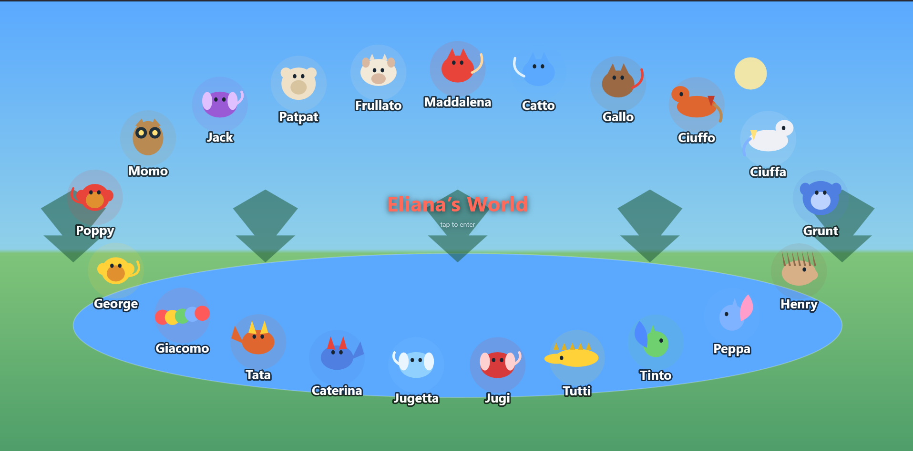

# 🌍 Il Mondo di Eliana

A cozy 2D soundscape world where a child's invented animal friends roam, play, and fall asleep with the day.



**Live:** open `index.html` (served) in any modern browser, tap to enter, and explore.

---

## What is it?

**Il Mondo di Eliana** ("Eliana's World") is a little living world built for a 3-year-old. It grew out of two ideas:

1. A soundscape toy inspired by [murmur.living](https://www.murmur.living/) — *"a place, not a playlist"* — where sound comes from a tiny simulated world instead of looping tracks.
2. A picture book, *Paws, Purrs and Tales*, written for Eliana using **animal characters she invented herself**.

So instead of generic creatures, the world is populated by **her** friends — Maddalena the giant red cat, Gallo the loud river cat, Tutti the gentle yellow crocodile, Momo the bronze owl, and 17 more — each with its own colour, shape, movement and sound.

## Features

- **Her characters, canonical** — 21 friends from the book, each a stylised geometric shape (à la murmur.living), coloured from the story.
- **Day / night that follows real time** — an analog clock (great for learning to read the hours!) drives the sky; drag the slider to play with time by hand.
- **At night the friends sleep** — the world winds down with the child. Only the ambient soundscape remains. A gentle bedtime cue.
- **Living sound** — each friend emits its own randomised sound; the environment (pond / forest / beach / park / home) has its own ambient bed. All synthesised live via the Web Audio API — **no audio files**.
- **Tap or hover** a friend to see its name.
- **Info panel** with every friend: picture, name, type, short description.
- **Sun & moon** that change colour through the day: pale-yellow dawn → full-yellow noon → red sunset → yellow-then-white moon.

## Tech

Deliberately minimal ([ponytail](https://github.com/DietrichGebert/ponytail) style):

- **No backend, no build, no dependencies, no audio assets.** Everything runs client-side.
- **2D `<canvas>`** for rendering, **Web Audio API** for procedural sound.
- The intro poster reuses the exact same `drawCreature()` function as the live world — zero duplication.

## Project structure (modular, editable)

Content lives in plain `.js` files anyone can edit — no build step. Folders:

```
index.html          entry point
config.js           ← personalize here (child's name, location)
content/            the editable data (make it yours)
  characters.js       the animal friends
  environments.js     the scenes
  creatures.js        the body shapes per species
locales/            translations (one file per language)
  it-IT.js  en-US.js
lib/                the engine (rarely touched)
  languages.js  sun.js  version.js
deploy.sh  README.md  CHANGELOG.md  LICENSE
```

| Edit… | to… |
|---|---|
| `config.js` | set the child's name + (optional) location |
| `content/characters.js` | **add / change an animal** |
| `content/environments.js` | **add / change a scene** |
| `content/creatures.js` | **add a new body shape** (species) |
| `locales/<code>.js` | **translate / add a language** (BCP 47 name) |

**Add a friend** → copy a line in `content/characters.js`, change the fields. If its `species` already exists (cat, dog, owl…), that's it. Only touch `content/creatures.js` for a brand-new body shape.

**Languages** → the world auto-detects the browser language (region fallback, e.g. `en-GB`→`en-US`; final fallback Italian). Toggle with the 🌐 button, or force with `?lang=en-US` / `?lang=it-IT`. Add a language by copying a file in `locales/` (named with its [BCP 47](https://en.wikipedia.org/wiki/IETF_language_tag) code, e.g. `fr-FR.js`) and adding its `<script>` tag in `index.html`.

Each file has a comment header explaining every field.

> Note: because it loads several `.js` files, open it via a served URL (e.g. `python3 -m http.server`) rather than double-clicking `file://`.

## Run it

Serve the folder with any static server:

```bash
python3 -m http.server 8000
# then visit http://localhost:8000
```

No install step. It's static.

## Versioning & deploy

The version shown in the info panel is **derived from git** (no manual bumping):

- `deploy.sh` runs `git describe` and writes `version.js` (read by the app).
- Between releases it auto-increments as `vX.Y-N-gHASH` (N commits after the last tag).

```bash
./deploy.sh          # deploy current state (version = git describe)
./deploy.sh v1.4     # tag a release and deploy
```

## The friends

| | Name | Type | About |
|---|---|---|---|
| 🐈 | Maddalena | Cat | Giant red cat with a super-fluffy tail; loves popcorn and obstacle courses. |
| 🐈 | Catto | Kitten | Tiny blue cat; picky-turned-brave, does the super-duper-mega-purr. |
| 🐈 | Gallo | Cat | Red-chinned, blue feathery tail; lives on a boat, has a huge voice. |
| 🐴 | Ciuffo | Horse | Sunset-patched horse; impetuous and playful, loves beach and park. |
| 🐴 | Ciuffa | Horse | Rainbow-patched mare; lively and curious, Ciuffo's best friend. |
| 🦍 | Grunt | Gorilla | Big bouncy blue gorilla; learns to throw only safe things. |
| 🦔 | Henry | Hedgehog | Super-excitable little hedgehog; loves car rides. |
| 🐿️ | Peppa | Squirrel | Cotton-candy squirrel; playful and messy, learns to tidy up. |
| 🐿️ | Tinto | Squirrel | Green-and-blue squirrel; Peppa's twin, stacks pinecones. |
| 🐊 | Tutti | Crocodile | Gentle serene yellow croc; helps friends by staying close. |
| 🐕 | Jugi | Dog | Cherry-red pup; playful and competitive, learns to share. |
| 🐕 | Jugetta | Dog | Sky-blue pup; Jugi's twin, builds block towers. |
| 🐺 | Caterina | Wolf | Blue-and-red caped wolf; mischievous, then generous. |
| 🐺 | Tata | Wolf | Autumn-coloured wolf; little sister, drums funny rhythms. |
| 🐛 | Giacomo | Caterpillar | Rainbow caterpillar; shy and sensitive, lives in a Play-Doh jar. |
| 🐵 | George | Marmoset | Wise, funny marmoset; teaches "stop-breathe-squeeze". |
| 🐵 | Poppy | Marmoset | Sweet calm marmoset; shows deep breathing with balloon cheeks. |
| 🦉 | Momo | Owl | Bronze owl with golden eyes; clever, collects happy thoughts. |
| 🐕 | Jack | Dog | Purple pup; playful, learns to calm down "like bubbles". |
| 🐻 | Patpat | Bear | Marshmallow-soft teddy; learns to sleep on his own. |
| 🐄 | Frullato | Cow | Vanilla-scented plush cow; the Night Protector, chases nightmares away. |

*(From the book "Paws, Purrs and Tales", characters invented by Eliana.)*

## Changelog

See [CHANGELOG.md](CHANGELOG.md) for the list of features and changes.

## License

[MIT](LICENSE) — do what you like, just keep the notice.

---

*Made with ❤️ for Eliana.*
